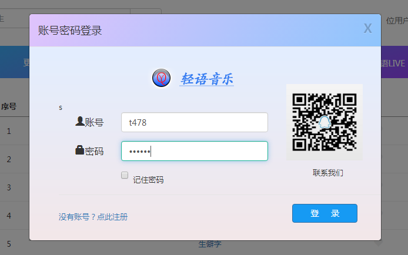
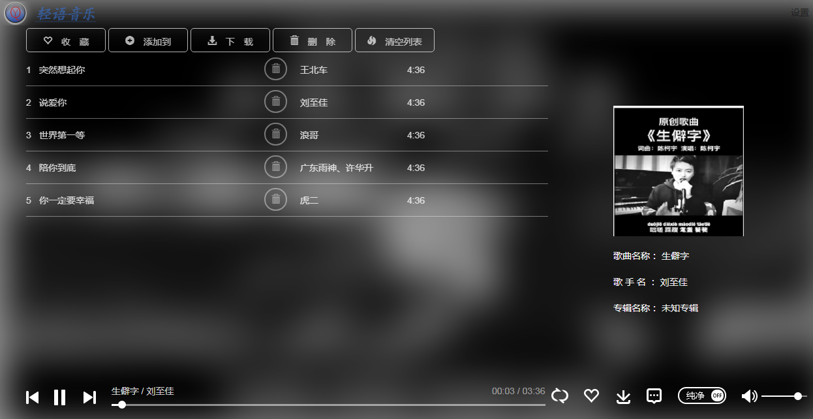
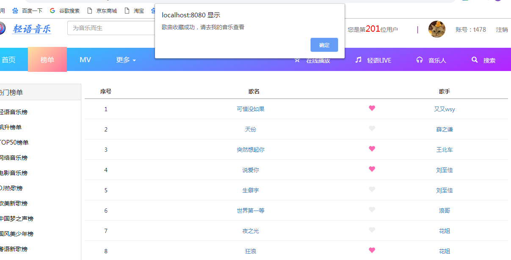
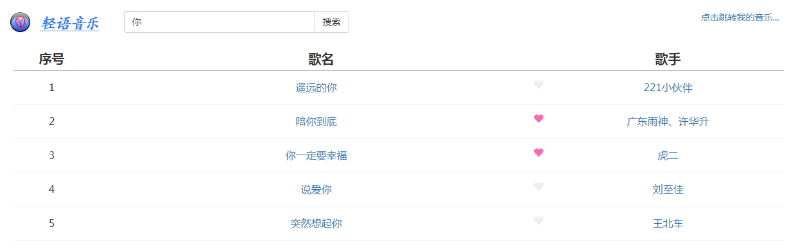
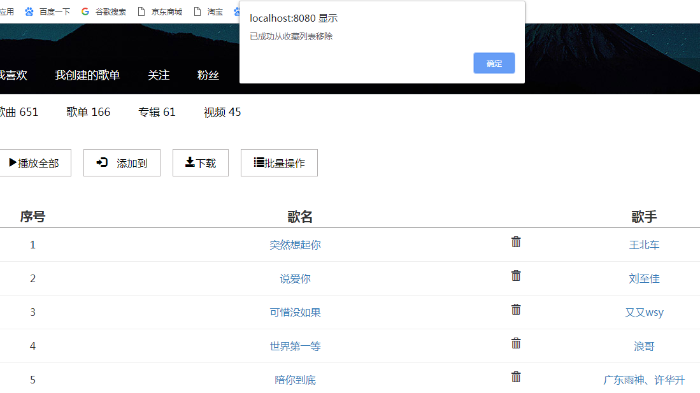
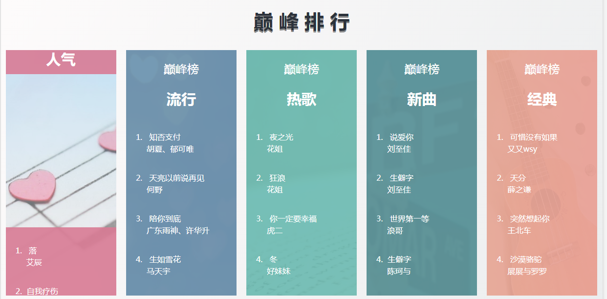

# Music-demo

## 主要用到的技术：

 * Maven
 * Springboot + Mybatis
 * Ajax
 * Bootstrap、Jquery 
 * MySQL
 * cookies
 * 阿里云OSS
 
 ## 主要分为六个模块
 
 * **用户管理模块**：用户登录、用户注册、修改密码
 * **榜单列表模块**：动态地从数据库中获取歌曲的链接和数据在榜单中显示
 * **歌曲搜索模块**：在首页的搜索框中可以输入关键字进行歌曲的模糊搜索
 * **歌曲收藏模块**：在榜单列表中或搜索页面中可以点击歌曲进行收藏
 * **我的音乐模块**：收藏的歌曲会被添加到我的音乐列表中，在我的音乐列表中也可以对歌曲进行删除操作
 * **音乐播放器模块**：在榜单、搜索页面和我的音乐列表等地方点击歌曲可以跳转到播放页面进行播放。播放页面显示播放进度条，删除歌曲，暂停等操作。播放页面背景为模糊背景，根据歌手的专辑图片自动变化。
 ## 问题：如何启动本系统？ 
 
 1. 将sql文件在MySQL运行生成表和数据
 2. 最后直接启动SsApplication类后访问http://localhost:8082/index.html 就可以进入本系统！
 3. github地址: https://github.com/AbnerQu/music-demo.git
 
 ## 功能展示
  * 主页
  
  
  
  * 登录注册
  
  
  
  * 播放页面
  
  
  
  * 收藏
  
  
  
  * 模糊搜索
  
  
  
  * 删除
  
  
  
  * 炫酷动画
  
  
